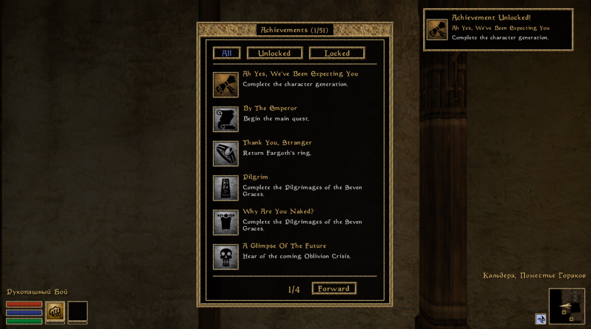

# OMW-Achievements

**OMW Achievements** - a mod that adds the ability to get achievements to the game. There is support for the adding your own achievements. 

It is a OpenMW version of MWSE mod “The Achievement Framework” by Safebox. The mod also includes achievements from “Morrowind Achievement Collection” by nazz190. Russian localization of achievements by Pirate443.

Requires OpenMW 0.49+.

 

 

## Installation

1. Download the mod.
2. Append the mod directory to the OpenMW's Data Directories (OpenMW -> Data Files -> Data Directories -> right top button labelled Append).
3. Enable the mod (OpenMW -> Data Files -> Content Files -> tick the checkbox of omw_achievements.omwscripts).
4. Enjoy!

 

## How to get achievements

Getting achievements **doesn't work** on old saves. You must **start a new game** after installing the mod to get achievements.

Achievements can be unlocked for: 
- quest completion
- starting a conversation with a specific NPC
- joining a faction
- gaining a certain rank in a faction
- performing different actions a certain number of times (e.g., reading a book 50 times, etc.)

After opening the achievement, the player receives a notification in the upper right corner of the screen.

The `o` button is used by default to open the achievement widget. Note that there are hidden achievements, the number of which is shown at the end of the list.

The hidden achievements feature is used to avoid spoilers and add interest in obtaining them. There is an option to turn it off in the mod settings.

 

## Mod version without built-in achievements

If you want to use the framework without the built-in achievements, it can be downloaded here. It can come in handy if you only want to use custom achievements.

 

## Wanna add your achievements?

I heard ya. I've written a special guide on how to add your own achievements. This may be relevant if you use mods that add new content, like quests or NPCs, and you want to get achievements for them too.

The guide is available [here](https://github.com/caz1que/OMW-Achievements/blob/main/docs/your-achievements.md).

 

## Special thanks

Special thanks to S3 and Qlonever for advice and help with UI development.
