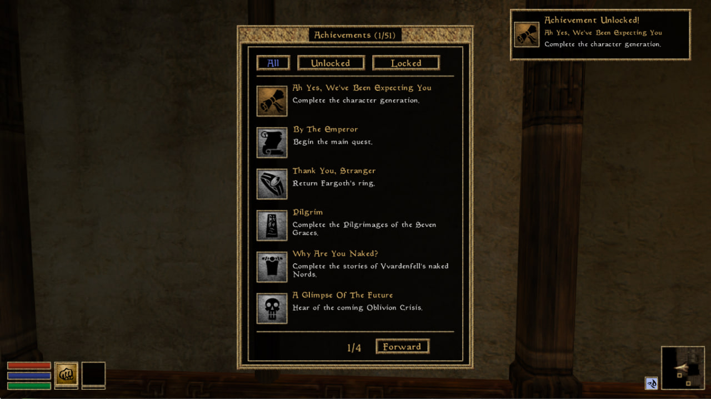

# OMW-Achievements

**OMW Achievements** - a mod that adds the ability to get achievements to the game. There is support for the adding your own achievements. 

It is a OpenMW version of MWSE mod “[The Achievement Framework](https://www.nexusmods.com/morrowind/mods/51081)” by Safebox. The mod also includes achievements from “[Morrowind Achievement Collection](https://www.nexusmods.com/morrowind/mods/53617)” by nazz190. Russian localization of achievements by Pirate443.

Requires OpenMW 0.49+.

 

 

## Installation

1. [Download](https://github.com/caz1que/OMW-Achievements/releases/latest) the mod.
2. Append the mod directory to the OpenMW's Data Directories (OpenMW -> Data Files -> Data Directories -> right top button labelled Append).
3. Enable the mod (OpenMW -> Data Files -> Content Files -> tick the checkbox of omw-achievements.omwscripts).
4. Enjoy!

 

## How to get achievements

Getting achievements **doesn't work** on old saves. You must **start a new game** after installing the mod to get achievements.

Achievements can be unlocked for: 
- quest completion
- starting a conversation with a specific NPC
- joining a faction
- gaining a certain rank in a faction
- visiting certain cells
- reading certain books
- equipping certain items
- performing different actions a certain number of times (e.g., reading a book 50 times, etc.)

After opening the achievement, the player receives a notification in the upper right corner of the screen (by default). You can change position of notification in the mod settings.

The `o` button is used by default to open the achievement widget. Note that there are hidden achievements, the number of which is shown at the end of the list.

The hidden achievements feature is used to avoid spoilers and add interest in obtaining them. There is an option to turn it off in the mod settings.

 

## How achievement progress is saved

Since v2.0.0 uses a single achievement progress storage shared between all your characters.

This means that if you get one achievement on one character, it will already be unlocked on another.

The shared achievement progress for all characters was made because it is impossible to get all achievements in one playthrough.

Also note that the tracked progress of player actions (locations visited, books read, etc.) is different for each character. This means that if you read 50 books on one character, and another 50 on another character, you will not get the "read 100 books" achievement. The actions required to unlock one achievement must be completed on one character.

Also in the mod settings, the ability to reset progress on achievements has been added (may be useful when reinstalling the mod or wanting to open achievements again).

 

## Mod version without built-in achievements

If you want to use the framework without the built-in achievements, it can be downloaded [here](https://github.com/caz1que/OMW-Achievements/releases/tag/v1.0.0-framework). It can come in handy if you only want to use custom achievements.

 

## Wanna add your achievements?

I heard ya. I've written a special guide on how to add your own achievements. This may be relevant if you use mods that add new content, like quests or NPCs, and you want to get achievements for them too.

The guide is available [here](https://omw-achievements.readthedocs.io/en/latest/index.html).

 

## Special thanks

- [Safebox](https://forums.nexusmods.com/profile/17885684-safebox/) for making "The Achievement Framework"
- [nazz190](https://forums.nexusmods.com/profile/441579-nazz190/) for making "Morrowind Achievement Collection"
- [Pirate443](https://forums.nexusmods.com/profile/193911948-pirate443/) for russian localization of achievements from MAC.
- [S3ctor](https://gitlab.com/magicaldave1) and **Qlonever** for advice and help with UI development.
- **Cybvep**, **illest503**, **m`aiq**, **Sosnoviy Bor** for ideas for mod and achievements.
- **The OpenMW team**, including every contributor for making OpenMW.
- **The MOMW team** for being amazing.
- **Bethesda** for making Morrowind.
